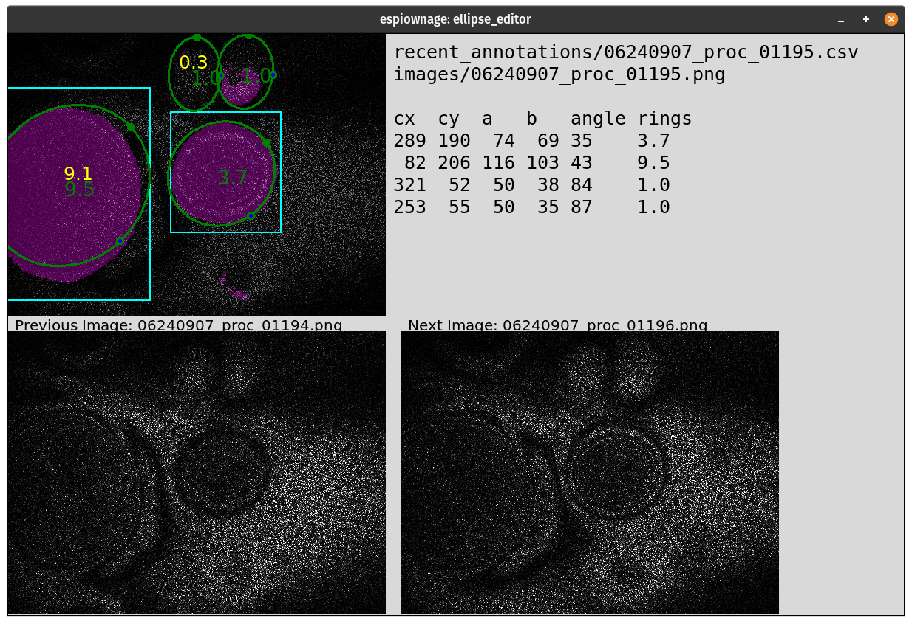

# espiownage


> Ownage of ESPI image inference. (Pronounced like "espionage" but with a little "own" in the middle.) 

This code repository accompanies the paper submission [**"espiownage:Tracking Transients in Drum Strikes Using Surveillance Technology"**](https://www.dropbox.com/s/30nqyl0srekmu0s/steelpan_neurips_2021.pdf?dl=0) for the [NeurIPS 2021](https://nips.cc/Conferences/2021/) workshop on [Machine Learning and the Physical Sciences.](https://ml4physicalsciences.github.io/2021/) 

<div align="center">

<div style="display:inline;width:10px;"></div>

</div>


This study consists of 3 models:  Two that go together (a bounding box detector that feeds cropped images into an antinode ring-counter) and another complements them (an image sementation code we use for regression by scaling the final activation of a "one-class" model.)


All this documentation is fully executable, either locally or on Colab. This is made possible by [nbdev](nbdev.fast.ai), the development system that enabled us to stay organized and do this project in only 18 days! 


These pages and [the GitHub repo they are generated from](https://github.com/maskedstudent/espiownage) are fully anonymized as are all the links that are used, so they're "safe" for reviewers to explore.  *Note that there is a "real" espiownage repo and PyPi entry (which is where the pip-installs used in these notebooks will pull from for setup/speed purposes) so don't go searching for that.*  Pending successful review of the paper, this repository will be redirected to the non-anonymous version.

## Install

### Preliminaries

Ubuntu (& probably other Linuxes):
```bash
sudo apt-get install python3-tk
```

Mac (with [Homebrew](https://brew.sh/))
```bash
brew install python-tk
```

Then on all systems, let's set up a virtual environment called `espi`. 
I like to put my environments in `~/envs`:

```
mkdir ~/envs; python3 -m venv ~/envs/espi; source ~/envs/espi/bin/activate
```
And then you want/need to update `pip` in case it gave you an ancient version:

```bash
python3 -m pip install pip --upgrade
```

### Pip install

```bash
pip install espiownage
```
Note: the requirements on this package follow a "kitchen sink" approach so that everything a student might need gets installed, e.g. `jupyter` and more. (And `wheel` because it speeds up the installations...I think.)

## How to use

Take a look at the tabs in the sidebar, which arranged in sections according the tasks of detecting antinodes in steelpan drum oscillations, counting the interference friges, and reporting tracking information so that scientists can better understand the rapid transient dynamics of these instruments -- it is the transients that give the instrument its distinctive sound! 

## Console Scripts
See the separate page on console scripts

## Contributing / Development 

You'll want to install more things:

```bash
pip install nbdev twine 
```

Fork this repo.  When you want to update your repo, one macro does it all (see `Makefile`):
```bash
make git_update
```
